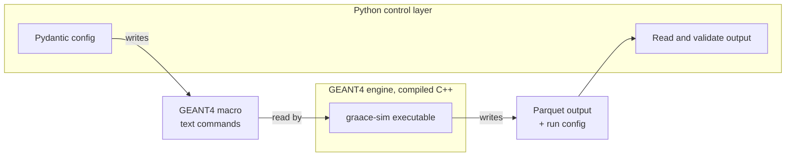

## GRAACE-SIM Architecture

This document provides the general architecture and design principles of 
the GRAACE-SIM framework, including its core components, data flow, and 
interaction with GEANT4 for simulating Prompt Gamma Activation Analysis 
(PGAA) experiments.

The design is a compiled GEANT4 engine driven by a Python control layer, with
every input and output validated by Pydantic models. A user sets up a neutron
source, a sample, shielding, and detectors, runs a simulation, and gets back
gamma-emission data — all without editing or recompiling the GEANT4 code.

## The two layers

GRAACE-SIM has two layers that talk to each other through a text command file (a
GEANT4 macro) and a data file. There are no Python-to-C++ bindings; the coupling
is deliberately simple.



The **GEANT4 engine** (`sim/`) is a standard GEANT4 application that does the
physics: neutron transport, neutron capture, gamma-ray production, and detector
response. It is built once and then driven entirely by configuration. It
registers a set of GEANT4 UI commands (through a `G4UImessenger`) that map onto
the configurable parts — `/source/*`, `/sample/*`, `/shielding/*`,
`/detector/*`, and `/output/*` — which the geometry builder reads back when it
constructs the world. The same binary therefore produces different experiments
depending only on the commands it is fed.

The **Python control layer** (`src/`) turns a validated configuration into a run
and reads the results back. It contains no physics — only setup, bookkeeping,
and validation: the Pydantic models (`src/models/`), YAML loading and macro
writing (`src/config/`), and the subprocess runner (`src/runner/`). Predefined
libraries of sources, materials, and detectors live in `catalogs/`.

## Directory structure

```
graace-sim/
├── sim/                    GEANT4 engine (compiled C++)
│   ├── apps/               main() entry point
│   ├── src/                geometry builder, source, actions, detector, output writer, command interface
│   ├── include/            C++ headers
│   ├── macros/             GEANT4 macros (text commands)
│   ├── tests/              GEANT4 engine tests
│   └── CMakeLists.txt      build definition
├── src/                    Python control layer
│   ├── models/             Pydantic configuration schema (the run record)
│   ├── config/             load YAML, expand catalog references, write the GEANT4 macro
│   ├── runner/             prepare the run folder, launch graace-sim, verify output
│   └── common/             shared helpers, including logging
├── catalogs/               predefined libraries of sources, materials, and detectors
├── examples/               example configurations and driver scripts
├── data/                   default output, one directory per run (macro, log, Parquet files)  [gitignored]
├── test/                   pytest suite, mirroring the src/ layout
├── docs/                   documentation
├── build/                  compiled GEANT4 engine  [gitignored]
├── pixi.toml               environment and task definitions
├── README.md
└── LICENSE
```

Directories marked `[gitignored]` are generated at runtime and are not tracked
by git.

## Purpose

GRAACE-Sim is meant to be a highly configurable and flexible simulation 
framework that will allow users to design and test potential PGAA 
experimental setups and measurements. It aims to be as user-friendly and 
accessible as possible, providing a robust platform for both novice and 
experienced researchers in the field of PGAA.

## Key Components

- `Pixi` is used for environment management, building binaries, and managing dependencies.
- `GEANT4` is used for simulating the physical interactions of particles within the experimental setup.
- `Pydantic` is used to build, validate and maintain a graace-sim record model, ensuring data integrity, consistency, and reproducibility throughout the simulation process.
- `Loguru` is used for logging and tracking the simulation configuration, execution, and processing progress, providing detailed information for debugging and analysis.


## Core GEANT4 Modules

Each module is configured independently and can be swapped without touching
compiled code.

- `Source Module` is responsible for handling the definition and configuration of particle sources used in the simulation. Examples include a DT generator at 14.1 MeV, a DD generator at 2.45 MeV, a Cf-252 spectrum, or a beamline source. It is configured through the General Particle Source.
- `Sample Module` is responsible for managing the definition and properties of the samples being studied in the simulation: composition (element and optional isotope mass fractions), density, shape, dimensions, and position.
- `Detector Module` is responsible for defining and configuring the detectors used in the simulation, including their geometry, materials, and response characteristics (for example an HPGe detector with a given energy resolution and placement). A setup may include more than one detector.
- `Shielding Module` is responsible for optional shielding placed in the setup: material, thickness, and placement.

## Configuration schema (Pydantic models)

All models inherit from a single strict base so that unknown fields are
rejected, assignments are re-validated, and mistakes surface immediately.

```python
class StrictModel(BaseModel):
    model_config = ConfigDict(
        extra="forbid",            # unknown keys are an error
        validate_assignment=True,  # re-validate when a field is changed
        populate_by_name=True,     # accept the field name or its alias
    )
```

The top-level model describes one experiment and doubles as the run record:

```python
class Simulation(StrictModel):
    source: Source          # the neutron source
    sample: Sample | None = None   # the material being assayed; optional
    detectors: list[Detector]
    shielding: list[Shielding] = []
    run: RunSettings        # number of events, random seed, physics options
    metadata: Metadata      # author, date, description, output location
```

Each part carries its own checks — for example, sample composition mass
fractions must sum to 1.0, element symbols are checked against the periodic
table, and each source type requires the fields it needs.

**Predefined libraries.** Common sources, sample materials, and detectors live
in catalogs. A configuration can name a catalog entry instead of spelling out
every field; the loader fills in the full definition and re-validates the
result. Users can always provide their own definitions inline.

## Data flow, end to end

1. **Load and validate.** `src/config` reads the YAML configuration and validates
   it as a `Simulation`. Any catalog references are expanded into full
   definitions and the merged configuration is validated again.
2. **Prepare the run folder.** The runner creates one directory per run, named
   from the run identifier, to hold the macro, the log, and the output.
3. **Write the macro.** The validated configuration is turned into the list of
   GEANT4 UI commands and written to a `.mac` file.
4. **Run the engine.** The runner launches `graace-sim <macro>` as a subprocess
   and streams its output to a log file.
5. **Engine produces output.** GEANT4 records gamma detector hits and writes them
   to Parquet files, alongside the run configuration.
6. **Validate the output.** Back in Python, the runner confirms the expected
   output exists and Pydantic validates its contents and the embedded
   configuration, so a run either yields a checked, self-describing result or a
   clear error.

## Output format and the run record

Output is written as **Parquet** files, stored with the full validated
configuration that produced them. This is the concrete form of the run record:
every run carries the exact settings that produced it, which makes runs
reproducible and directly comparable to one another and to experimental
measurements. The primary recorded
quantity is the gamma-emission data — the energies and counts seen by each
detector — from which spectra, sensitivity estimates, and minimum-flux estimates
are built.

