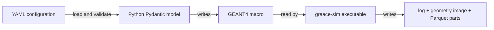

# GRAACE-SIM architecture

GRAACE-SIM is a compiled GEANT4 engine driven by a Python control layer. The
Python side validates YAML configuration and writes a GEANT4 macro. The C++ side
reads that macro, builds the experiment, transports particles, and writes detector
responses as Parquet files.

## The two layers

The layers communicate through a text macro and output files. There are no
Python-to-C++ bindings.



The **Python control layer** (`src/graace_sim/`) contains the Pydantic models,
YAML loader, macro writer, and subprocess runner. It prepares the run directory,
starts `graace-sim`, streams the engine output to `logs/run.log`, and optionally
checks that every detector has at least one Parquet file.

The **GEANT4 engine** (`sim/`) builds the world and simulates particle transport.
`Messenger` receives `/source/*`, `/sample/*`, `/detector/*`, `/shielding/*`, and
`/output/*` commands. `DetectorConstruction` builds the configured geometry;
the actions and sensitive detectors record detector responses; `SimIO` writes the
Parquet parts.

## Directory structure

```text
graace-sim/
├── sim/                    compiled GEANT4 engine
│   ├── apps/               executable entry point
│   ├── include/            C++ headers
│   ├── src/                C++ implementations
│   ├── macros/             hand-written GEANT4 macros
│   └── CMakeLists.txt      engine build definition
├── src/graace_sim/         Python control layer
│   ├── models/             validated configuration models
│   ├── config/             YAML loading and macro writing
│   └── runner/             process launch and output checks
├── examples/               YAML configurations and helper scripts
├── test/                   Python test suite
├── docs/                   ReadTheDocs and Sphinx source
├── data/                   default runtime output [gitignored contents]
├── build/                  local build output [gitignored contents]
├── pixi.toml               environment and task definitions
├── README.md
└── LICENSE
```

## Configuration and data flow

1. `load_simulation()` reads YAML with `yaml.safe_load()` and validates it as a
   `Simulation` model.
2. `write_macro()` creates `<working_directory>/<run_id>_<sub_run>/` and writes
   the GEANT4 commands to `<run_id>.mac`.
3. `run_simulation()` launches the configured binary, normally `graace-sim`, and
   writes its combined output to `logs/run.log`.
4. The engine builds the geometry, runs the requested number of neutron events,
   and writes per-detector Parquet part files under `results/`.
5. With output verification enabled, Python checks that each configured detector
   has at least one Parquet file.

The original YAML and generated macro are the current record of the settings for
a run. The runner does not embed a serialized configuration in the Parquet files.

## Main configuration parts

- **Source:** particle name, position and emission shape, mono or spectrum energy,
  and optional pulse timing. The engine uses GEANT4's General Particle Source.
- **Sample:** optional material composition, density, shape, dimensions, and
  position. Element mass fractions and optional isotope atom fractions are
  validated by Pydantic.
- **Detectors:** one or more named HPGe detector cylinders. The Python model also
  accepts `type` and `energy_resolution_kev`, but the current macro and engine use
  the name, position, and dimensions only; detector response smearing is not yet
  implemented.
- **Shielding:** zero or more square slabs with a GEANT4 material, thickness, and
  position.
- **Run and runner:** neutron count and random seed are separate from launch
  settings such as the executable name, progress display, output verification, and
  CPU percentage.

## Output

Each detector has its own directory. The engine writes one row per event that
leaves positive energy in that detector. The row contains `energy` in keV and
`time` in ns. Part files include a worker identifier, for example:

```text
results/<detector_name>/gamma_hits-part-w000-00000.parquet
```

The automatic geometry picture is `results/geometry.png` when offscreen graphics
are available. It may be absent for an interactive viewer or a build without an
offscreen driver.
